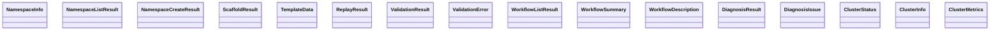

# Type Relations

Type relationships showing interface implementations and embedded types

```mermaid
classDiagram
    class NamespaceInfo {
    }
    class NamespaceListResult {
    }
    class NamespaceCreateResult {
    }
    class ScaffoldResult {
    }
    class TemplateData {
    }
    class ReplayResult {
    }
    class ValidationResult {
    }
    class ValidationError {
    }
    class WorkflowListResult {
    }
    class WorkflowSummary {
    }
    class WorkflowDescription {
    }
    class DiagnosisResult {
    }
    class DiagnosisIssue {
    }
    class ClusterStatus {
    }
    class ClusterInfo {
    }
    class ClusterMetrics {
    }
```
